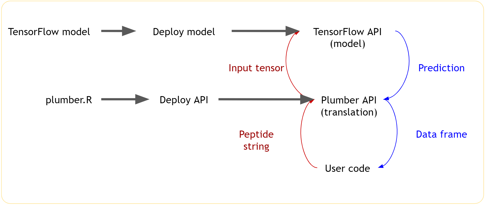

<!-- README.md is generated from README.Rmd. Please edit that file -->

```{r, include = FALSE}
knitr::opts_chunk$set(
  collapse = TRUE,
  comment = "#>"
)
```
# immunotherapy

<!-- badges: start -->
<!-- badges: end -->

The goal of `immunotherapy` is to demonstrate building a TensorFlow model in immunotherapy, based on peptide data.

This is based on the the original work by Leon Eyrich Jessen, and his blog post on RViews: ["Deep Learning for Cancer Immunotherapy"](https://blogs.rstudio.com/tensorflow/posts/2018-01-29-dl-for-cancer-immunotherapy/)

## Requirements

Packages for sequence logos and peptides

```r
devtools::install_github("omarwagih/ggseqlogo")
devtools::install_github("leonjessen/PepTools")
```

## About peptides

From [Wikipedia](https://en.wikipedia.org/wiki/Peptide)

> Peptides (from Greek language πεπτός, peptós "digested"; derived from πέσσειν, péssein "to digest") are short chains of amino acid monomers linked by peptide (amide) bonds.


The package `PepTools` is "An R-package for making immunoinformatics accessible". For example, it exports a function `pep_encode()` to convert a peptide string, e.g. "LLTDAQRIV" into a numerical representation:

```{r}
suppressPackageStartupMessages({
  library(PepTools, quietly = TRUE)
  library(magrittr, quietly = TRUE)
})

#' Use palette from ColorBrewer to recolour the image
#'
#' @param x Matrix
#' @param palette ColorBrewer palette. This value is passed to [scales::col_numeric()]
#' @param zero_colour Colour to use for zero and NA values
#' @param invert If `TRUE`, inverts the colour scale
recolour <- function(x, palette = "Blues"){
  dims <- dim(x)
  col_range <- range(x, na.rm = TRUE)
  col_custom <- scales::col_numeric(
    palette = palette, domain = col_range
  )
  as.raster(matrix(col_custom(x), nrow = dims[1], ncol = dims[2]))
}

# Plot peptide representation
plot_peptide <- function(x, palette = "Blues"){
  
  plot.new()
  x %>% 
    pep_encode() %>%
    .[1, , ] %>% 
    recolour(palette = palette) %>% 
    rasterImage(0, 0, 1, 1, interpolate = FALSE)
  title(paste0("Peptide representation of ", x))
}

plot_peptide("LLTDAQRIV")
```

## Beyond peptides (other practical application)

The machine learning task is quite simple, but also a good example of an extremely common modeling task:

* Predict the class of an observation, based on some features of this observation
* In the case of the peptides example, the observation is a text string, which is expanded into a 9x20 tensor, and the task is a ulti-class classification.

Many other problems are very similar, for example:

* Binary classificiation of credit card default
* Multi-class classification of images
* Preduction of customer churn (binary class)

In the case of the peptides, the modeling task is very simple, allowing the focus on the overall production deployment process.  In many real-world situations the modeling task is likely to be much more complex.


## Workflow

The objective is to create a TensorFlow model that can be called by user code. The user code sends a request as a peptide string and receives a response in the form of a data frame of predicted classes.

However, to achieve this, we need an intermediate function to translate the string into a peptide representation and a tensor of the shape that the model expects.





## Deploying the model yourself


Then follow these steps:

1. Ensure all the pre-requisites are in place

  * Ensure you have access to a RStudio Connect instance with permissions to publish APIs.  The instance should be configured to run TensorFlow models.
  * Run the file `0_install_pre_reqs.R` - this will install all the required packages, including `keras`, if not already installed.
    
  * Make sure you have established a connection to Connect

    * For example, deploy a test Shiny app
    * Specifically, the result of `rsconnect::accounts()` should not be empty


1. Train the model

    * Run `1_train_model.R`
    * This trains the TensorFlow model

1. Publish the model to Connect

    * At the moment there is no push-button deployment of TensorFlow models to Connect
    * Run `2_publish_model.R`
    * This publishes the model to Connect
    * Change the permissions to be open the model to the world (no login required)
    * Make a note of the "Solo URL"
    
1. Edit `config.yml` with solo url

    * Add your solo url to `solo_url_tensorflow`
      
1. Publish the plumber API to Connect

    * Run `4_publish_api.R`
    * Change the permissions to be open the model to the world (no login required)
    * Make a note of the "Solo URL"
    * Try to execute the model from the Swagger page
    
1. Edit `config.yml` with solo url

    * Add your solo url to `solo_url_plumber`

1. Consume the model

    * Open the file `5_consume_api.R`
    * Run the code and watch the predictions flow in!


    
